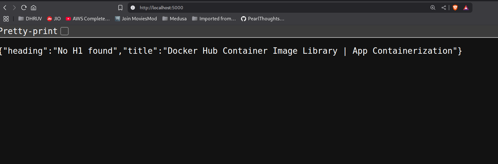

# Scraper

This project performs basic website scraping using Puppeteer. It extracts data such as titles, headings, links, and meta descriptions from a webpage. The scraped data is saved to a `scraped_data.json` file. A Python server (`server.py`) reads this file and serves the data.  
You can access the data by visiting `http://localhost:5000`. All of this is done in a containerized environment using Docker.



# How to Use

1. Clone the repository to your local machine and navigate into it:
    ```bash
    git clone https://github.com/dhruvmistry2000/Web-scraper
    cd Web-scraper
    ```

2. Build the Docker image from the [Dockerfile](Dockerfile) using the following command:
    ```bash
    docker build -t web-scraper .
    ```
    > Note: You can also find the pre-built image on [Docker Hub](https://hub.docker.com/repository/docker/dhruvmistry200/web-scraper/general).

3. Run the web-scraper Docker container using the following command:
    ```bash
    docker run -d -e SCRAPE_URL=<the URL you want to scrape> -p 5000:5000 web-scraper
    ```
    Replace `<the URL you want to scrape>` with the target webpage URL.

Once the container is running, visit `http://localhost:5000` in your browser to view the scraped data.
